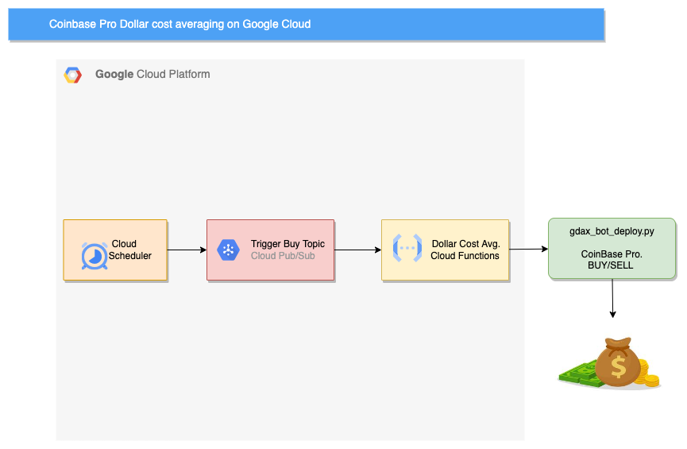

# gcp_gdax_bot

A basic Coinbase Pro buying bot that trades in any of their available market pairings with instructions to deploy on google cloud for automated dollar cost averaging.


This repo is forked from [kdmukai/gdax_bot](https://github.com/kdmukai/gdax_bot).
I have updated some trivial parts of the code to make it easy to deploy on google cloud. <BR>Personally, I use this repo to trigger a `$2 BTC-USD buy every hour`.

Relies on [gdax-python](https://github.com/danpaquin/gdax-python). Props to [danpaquin](https://github.com/danpaquin) and thanks!

## Schedule automated recurring buys via Google Cloud
Click [here](gcp_deploy_readme/README.md) for detailed instructions

Click [here](btcbot/README.md) for detailed instructions on how to host it on Amazon Web Service (AWS)




## Trading Philosophy
### Coinbase Pro overview
Coinbase Pro is the more professional cryptocurrency exchange that underlies Coinbase. If you have a Coinbase account, you have a Coinbase Pro account ([create a Coinbase account](https://www.coinbase.com/join/59384a753bfa9c00d764ac76)). All trades on Coinbase include expensive tiered flat fees ($0.99+/tx) or 1.49%, plus a 0.5% spread on the market price (or up to 2% spread on crypto-to-crypto trades). Ouch.

But some trades on Coinbase Pro can be made at a greatly reduced rate (0.5%) or even free, depending on your transaction tier over the last 30 days. You just have to submit your buy or sell as a limit order. You are the "maker" of an offer and you await a "taker" to accept. The "takers" pay the fees, the "maker" pays a reduced fee (depending on your transaction tier). The tradeoff is that limit orders may or may not be fulfilled; if you're selling X crypto at $Y value and no one likes your price, your sell order won't go anywhere.

### Basic investing strategy: Dollar Cost Averaging
You have to be extremely lucky or extremely good to time the market perfectly. Rather than trying to achieve the perfect timing for when to execute a purchase just set up your investment on a regular schedule. Buy X amount every Y days. Sometimes the market will be up, sometimes down. But over time your cache will more closely reflect the average market price with volatile peaks and valleys averaged out.

This approach is common for retirement accounts; you invest a fixed amount into your 401(k) every month and trust that the market trend will be overall up over time.

### Micro Dollar Cost Averaging for cryptos
While I believe strongly in dollar cost averaging, the crypto world is so volatile that making a single, regular buy once a month is still leaving too much to chance. The market can swing 30%, 50%, even 100%+ in a single day. I'd rather invest $20 every day for a month than agonize over deciding on just the right time to do a single $600 buy.

And because we can do buy orders on Coinbase Pro with no fees (so long as they're submitted as limit orders), there's no penalty for splitting an order down to smaller intervals.

### How far can you push micro dollar cost averaging?
Coinbase Pro sets different minimum order sizes for each crypto.

[Current minimums](https://blog.Coinbase Pro.com/market-structure-update-2650072c6e3b) as of 2018-01-11 are:
```
BTC: 0.001
ETH: 0.01
LTC: 0.1
BCH: 0.01
XLM: 1.0
```

This combined with the current market price gives us the minimum fiat transaction amount.

For example, let's say BTC is at $8,000 USD. So the smallest possible buy order is ```$8,000*0.001 = $8.00```. So if you were looking to invest $100 each month, you could do ```floor($100/$8) = 12``` equal-sized buy orders; you couldn't do 13 equal-sized orders because ```$100/13 = $7.69``` which would only be 0.00096 BTC. An order that small would be rejected by the API. Spreading out your $100 over 12 buys during the month is pretty good dollar cost averaging.

It gets even more fun if you have more money to invest. Let's say you have $900 and the minimum fiat transaction amount is less than $10. You can split your funds into 90 equal parts--that's three equal buy orders per day: $10 every eight hours. At this point your total average cost basis for your crypto should be just about identical to its average cost for the month.

I'm a big believer in this strategy for smoothing out crypto's short-term volatility while continuing to place your bets on its long-term value.

### Adjust as prices change
If the crypto price keeps increasing, eventually your schedule will run up against the minimum purchase order size; you can't buy $13.9 of LTC if the price is greater than $139 (LTC's minimum order size is 0.1). In that case you'll have to increase how much you buy in each order, but decrease the frequency of the orders.


## Technical Details
### Basic approach
gdax_bot pulls the current bid and ask prices, averages the two to set our order's price, then submits it as a limit order.

### Making a valid limit order
Buy orders will be rejected if they are at or above the lowest sell order (think: too far right on the order book) (see: https://stackoverflow.com/a/47447663) and vice-versa for sells. When the price is plummeting this is likely to happen. In this case gdax_bot will pause for a minute and then grab the latest price and re-place the order. It will currently attempt this 100 times before it gives up.

_*Longer pauses are probably advantageous--if the price is crashing, you don't want to be rushing in._

### Setup
#### Create a Coinbase account
Use my referral code and we'll both get $10 worth of BTC:
https://www.coinbase.com/join/59384a753bfa9c00d764ac76

#### Create a virtualenv
There's plenty of info elsewhere for the hows and whys.

#### Install requirements
```
pip install -r requirements.txt
```

#### Create Coinbase Pro API key
Try this out on Coinbase Pro's sandbox first. The sandbox is a test environment that is not connected to your actual fiat or crypto balances.

Log into your Coinbase/Coinbase Pro account in their test sandbox:
https://public.sandbox.pro.coinbase.com/

Find and follow existing guides for creating an API key. Only grant the "Trade" permission. Note the passphrase, the new API key, and API key's secret.

While you're in the sandbox UI, fund your fiat account by transferring from the absurd fake balance that sits in the linked Coinbase account (remember, this is all just fake test data; no real money or crypto goes through the sandbox).


#### (Optional) Create an AWS Simple Notification System topic
This is out of scope for this document, but generate a set of AWS access keys and a new SNS topic to enable the bot to send email reports.

_TODO: Make this optional_


#### Customize settings
Update ```settings.conf``` with your API key info in the "sandbox" section. I recommend saving your version as ```settings-local.conf``` as that is already in the ```.gitignore``` so you don't have to worry about committing your sensitive info to your forked repo.

If you have an AWS SNS topic, enter the access keys and SNS topic.

_TODO: Add support to read these values from environment vars_


#### Try a basic test run
Run against the Coinbase Pro sandbox by including the ```-sandbox``` flag. Remember that the sandbox is just test data. The sandbox only supports BTC trading.

Activate your virtualenv and try a basic buy of $100 USD worth of BTC:
```
python gcp_gdax_bot_deploy.py BTC-USD BUY 100 USD -sandbox -c ../settings-local.conf
```

Check the sandbox UI and you'll see your limit order listed. Unfortunately your order probably won't fill unless there's other activity in the sandbox.


### Usage
Run ```python gcp_gdax_bot_deploy.py -h``` for usage information:

```
usage: gcp_gdax_bot_deploy.py [-h] [-sandbox] [-warn_after WARN_AFTER] [-j]
                   [-c CONFIG_FILE]
                   market_name {BUY,SELL} amount amount_currency

        This is a basic Coinbase Pro DCA buying/selling bot.

        ex:
            BTC-USD BUY 14 USD          (buy $14 worth of BTC)
            BTC-USD BUY 0.00125 BTC     (buy 0.00125 BTC)
            ETH-BTC SELL 0.00125 BTC    (sell 0.00125 BTC worth of ETH)
            ETH-BTC SELL 0.1 ETH        (sell 0.1 ETH)


positional arguments:
  market_name           (e.g. BTC-USD, ETH-BTC, etc)
  {BUY,SELL}
  amount                The quantity to buy or sell in the amount_currency
  amount_currency       The currency the amount is denominated in

optional arguments:
  -h, --help            show this help message and exit
  -sandbox              Run against sandbox, skips user confirmation prompt
  -warn_after WARN_AFTER
                        secs to wait before sending an alert that an order isn't done
  -j, --job             Suppresses user confirmation prompt
  -c CONFIG_FILE, --config CONFIG_FILE
                        Override default config file location
```


### Scheduling your recurring buys
This is meant to be run as a crontab to make regular purchases on a set schedule. Here are some example cron jobs:

$50 USD of ETH every Monday at 17:23:
```
23 17 * * 1 /your/virtualenv/path/bin/python -u /your/gdax_bot/path/src/gcp_gdax_bot_deploy.py -j ETH-USD BUY 50.00 USD -c /your/settings/path/your_settings_file.conf >> /your/cron/log/path/cron.log
```
*The ```-u``` option makes python output ```stdout``` and ```stderr``` unbuffered so that you can watch the progress in real time by running ```tail -f cron.log```.*

€75 EUR of BTC every other day at 14:00:
```
00 14 */2 * * /your/virtualenv/path/bin/python -u /your/gdax_bot/path/src/gcp_gdax_bot_deploy.py -j BTC-EUR BUY 75.00 EUR -c /your/settings/path/your_settings_file.conf >> /your/cron/log/path/cron.log
```

£5 GBP of LTC every day on every third hour at the 38th minute (i.e. 00:38, 03:38, 06:38, 09:38, 12:38, 15:38, 18:38, 21:38):
```
38 */3 * * * /your/virtualenv/path/bin/python -u /your/gdax_bot/path/src/gcp_gdax_bot_deploy.py -j LTC-GBP BUY 5.00 GBP -c /your/settings/path/your_settings_file.conf >> /your/cron/log/path/cron.log
```


### Unfilled orders will happen
The volatility may quickly carry the market away from you. Here we see a bunch of unfilled orders that are well below the current market price of $887.86:


The gdax_bot will keep checking on the status of the order for up to an hour, after which it will report it as OPEN/UNFILLED. Hopefully the market will cool down again and return to your order's price, at which point it will fill (though gdax_bot will not send a notification). You can also manually cancel the order to free up the reserved fiat again.

I would recommend patience and let the unfilled order ride for a few hours or days. With micro dollar cost averaging it doesn't really matter if you miss a few buy orders.


#### Mac notes
Edit the crontab:
```
env EDITOR=nano crontab -e
```

View the current crontab:
```
crontab -l
```

#### Raspberry Pi notes
Download and flash Raspbian to an SD card using Balena Etcher. You can use a "headless" version (Raspbian Lite) with no monitor, no keyboard, no mouse with the following steps.

Remove and re-insert the SD card into the computer.

Enable ssh:
```
touch /Volumes/boot/ssh
```

Preload wifi credentials. Begin editing a new file called:
```
nano /Volumes/boot/wpa_supplicant.conf
```

and customize for your network:
```
country=US
ctrl_interface=DIR=/var/run/wpa_supplicant GROUP=netdev
update_config=1
network={
   ssid="your wifi network name"
   psk="your wifi password"
   key_mgmt=WPA-PSK
}
```

Insert the SD card into the Raspberry Pi and power up. After about a minute try to ssh into it:
```
ssh pi@raspberrypi.local

# default password is: raspberry
```

Once you're in change the default password:
```
passwd
```

Permanently enable ssh access (seems to revert to closing it off otherwise):
```
sudo systemctl enable ssh
```

Install automatic updates:
```
sudo apt-get install unattended-upgrades apt-listchanges
```


## Disclaimer
_I built this to execute my own micro dollar cost-averaging crypto buys. Use and modify it at your own risk. This is also not investment advice. I am not an investment advisor. You should do your own research and invest in the way that best suits your needs and risk profile.  Good luck and HODL strong._


# Tips
If you found this useful, send me some digital love
- ETH: 0xb581603e2C4eb9a9Ece4476685f0600CeB472241
- BTC: 13u1YbpSzNsvVpPMyzaDAfzP2jRcZUwh96
- LTC: LMtPGHCQ3as6AEC9ueX4tVQw7GvHegv3fA
- DASH: XhCnytvKkV44Mn5WeajGfaifgY8vGtamW4
