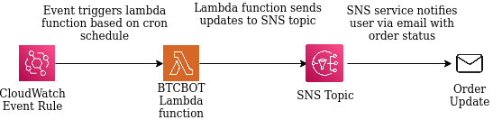
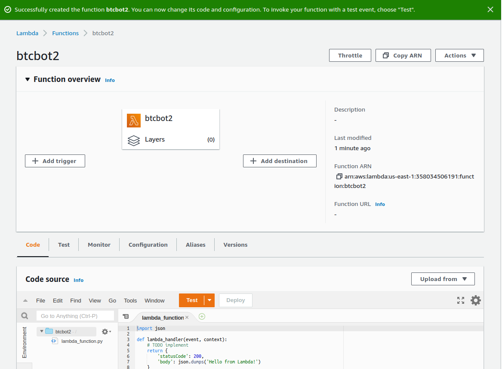

### AWS Implementation

The instruction set here will allow users to set up gdax bot on Amazon Web Service (AWS). All the components used are available as part of free teir membership offered by AWS. If the instruction set is followed exactly no opertational cost should be incured by the user.

### System design:



1. **CloudWatch Events:** Cloudwatch event is registered with rule to trigger the lambda function. User can schedule the trigger using cron schedule. For example: 59 * * * ? * trigger the bot every 59th minute of the hour. 59 0/2 * * ? * trigger the bot at 59th minute every 2 hours. User can use the guide [here](https://docs.aws.amazon.com/AmazonCloudWatch/latest/events/ScheduledEvents.html) to create custom cron experssion. 
For free tier users all state change events published by AWS services by default are free.More information on pricing available here: https://aws.amazon.com/eventbridge/pricing/


2. **Lambda Function** - Lambda compute service executes the code to purchase crypto using coinbase pro sdk. The AWS Lambda free tier includes one million free requests per month and 400,000 GB-seconds of compute time per month, usable for functions powered by both x86, and Graviton2 processors, in aggregate. More information on pricing available here: https://aws.amazon.com/lambda/pricing/

3. **SNS Topic** - Simple notification service recieves update from the lambda function and sends email notification to the user. Note SNS service can notify user at different channels like text message it can also send notification to limited applications. I prefer receiving notification on my email. The instruction set covers instruction for setting up notification using email service. First 1 million Amazon SNS requests per month are free and 1000 email notifications per month are free. More information on pricing available here: https://aws.amazon.com/sns/pricing/


### Setup:

In order to setup the gdax bot users will need to setup components listed above in their AWS account.


#### Assumptions and Constraints:
- This instruction sets assume user already has AWS account
- This instruction sets assume user already has coinbase pro account and api keys/secrets setup
- The code used by the bot is writtern in Python v3.9.

#### Setup SNS Topic:

- Go to [AWS Console](https://us-east-1.console.aws.amazon.com/console/home?region=us-east-1#) and search for `SNS`
- Click on Simple Notification Service
- From the column on the left side click on `Topics`
- Click on `Create topic`
- Select `Standard` for type
- Name your topic `btcbot_notification`
- Keep every other configuration as-is and click on `create topic`
- Copy the ARN number and paste it in `settings-local-template.conf` file.
- Next we want to create subscritpion. Click on `Create subscription`
- Select `Email` for protocol from the drop down menu
- Enter the email address on which you want to receive notification
- Click `Create subscription`
- At this point the subscription is not confirmed. The user will receive email from AWS asking to confirm the subscription. The user will need to follow the instructions from the email to confirm the subscription.


#### Setup Lambda Function:

By default AWS lambda function supports python however the python run time environment is bare minimum. Requiring us to create deployment package with the python dependency in it. In our case the bot has dependency on the coinbase pro sdk.

##### Step 1: Create deplyment package:
- Clone this repo on your local environment
- Navigate to the clone repo and step into the btcbot dir: 
    ```bash
        cd <PATH_TO_REPO>/gcp_gdax_bot/btcbot/
    ```

    The directory stucture should look like this:
        
        
        - btcbot
            - README.md
            - aws_dependency.txt
            - aws_gdax_bot.py
            - settings-local-template.conf
        
        
- Install the cbpro library to a new `package` directory:

    ```bash 
       pip install --target ./package -r aws_dependency.txt
    ```

- Update the `settings-local-template.conf` with your api key/secret and sns topic details.
- Rename the `settings-local-template.conf` to `settings-local.conf`
- Create a deployment package with the installed library at the root:

    ```bash
       cd package
       zip -r ../btcbot-package.zip .
    ```
    
    This generates a btcbot-package.zip file in the `btcbot` directory
- Step back a directory:
    ` cd ..`
- Add the `aws_gdax_bot.py` and `settings-local.conf` file to the root of the zip file:
    ```bash
       zip -g btcbot-package.zip aws_gdax_bot.py
       zip -g btcbot-package.zip settings-local.conf
    ```

##### Step 2: Create Lambda function
- Go to [AWS Console](https://us-east-1.console.aws.amazon.com/console/home?region=us-east-1#) and search for `lambda`
- Click on create new function
- Name the function `btcbot`
- Select `Python 3.9` as the runtime from dropdown menu
- Click on create function button (bottom left corner of the screen)
- You will be directed to your newly created function and should look like this:

    **Note:** I had already created function name `btcbot` as a result for the purpose of this instruction set I created another function called `btcbot2`
- From `Upload from` drop down select `.zip file`.
- Upload the package created from *Step 1* and click on `Save`.
- Once the packages is uploaded you should see your code `aws_gdax_bot.py` and `settings-local.conf` along with all dependcies in **Code source** frame.
- By default the lambda timeout is set to 3secs. You will need to update it to minimum of 6mins.
- To change the default timeout period click on the `Configuration` tab.
- Select `General configuration` and select edit.
- Update the `Timeout` to 8 mins and click save.


#### Setup CloudWatch Event:

- Go to [AWS Console](https://us-east-1.console.aws.amazon.com/console/home?region=us-east-1#) and search for `Amazon EventBridge`
- From the welcome screen select `Create Rule`. If the option is not available on welcome screen user can navigate to it by clicking on the `Rules` option from the column on left side of the page.
- Name the rule `triggerbot`
- Select `Schedule` as the rule type and click next.
- Leave the schedule pattern option as-is and enter your desired cron expression. For example 59 * * * ? * trigger the bot on 59th minute of every hour.
- Update the timezone as needed
- Select `Lambda function` as the target from the drop down menu
- Select the function `btcbot` from the drop down menu
- Expand the `Additional settings` section
- Change the configure target input from `Matched Events` to `Constant (JSON text)`
- In the editor below enter the following json structure and click next:
  ```bash
    {
        "attributes": {
        "market_name": "BTC-USD", # Crypto you are interested in buying. BTC-USD - Buy bitcoin using US dollars.
        "order_side": "BUY",
        "amount": "5.00", # Amount you want to buy
        "amount_currency": "USD",
        "config_file": "./settings-local.conf", 
        "job": "True"
    }
    }
  ```
  Adjust the amount as needed. The minimum purchase amount is 1.00 dollar.
- Create tags if you want and Click Next
- Review the configuration and click `Create Rule`

#### Connect all components together

At this point we have setup each components and now we need to connect all 3 components to finish our setup.

##### Connect CloudWatch Event and the Lambda Function:
- Navigate to your lambda function
- Click on `Configuration` and select `Triggers` from the column on the left.
- Click on `Add trigger`
- Select `EventBridge` from the drop down option for Trigger configuration
- Select the trigger rule `triggerbot` from the existing rules drop down option and click add

##### Connect Lambda Function with the SNS Topic:
- Navigate to your lambda function
- Click on `Configuration` and select `Permissions` from the column on the left.
- By default an execution role will be attached to your function. The role name will look like `btcbot-role-<random_characters>`
- Click on the role, it will open a new tab in your browser
- Click on `Add permissions` and then click `Create inline policy`
- In the JSON editor paste the following policy:
    ```bash
        {
            "Version": "2012-10-17",
            "Statement": [
                {
                    "Effect": "Allow",
                    "Action": [
                        "sns:Publish",
                        "sns:Subscribe",
                        "sns:CreateTopic",
                        "sns:GetTopicAttributes",
                        "sns:SetTopicAttributes",
                        "sns:TagResource",
                        "sns:UntagResource",
                        "sns:ListTagsForResource",
                        "sns:ListSubscriptionsByTopic"
                    ],
                    "Resource": [
                        "<YOUR ARN FOR THE SNS TOPIC"
                    ]
                }
            ]
        }
    ```
    
    **Note:** In the above policy enter your arn under the resources field. It is the same value that you copied in settings-local.conf file.
- Click `Review Policy` and give your policy a name, then click `Create policy`

At this point all setup is completed. Your bot will execute on 59th minute of the hour if you used the cron experssion from the example in *Setup CloudWatch Event*.
