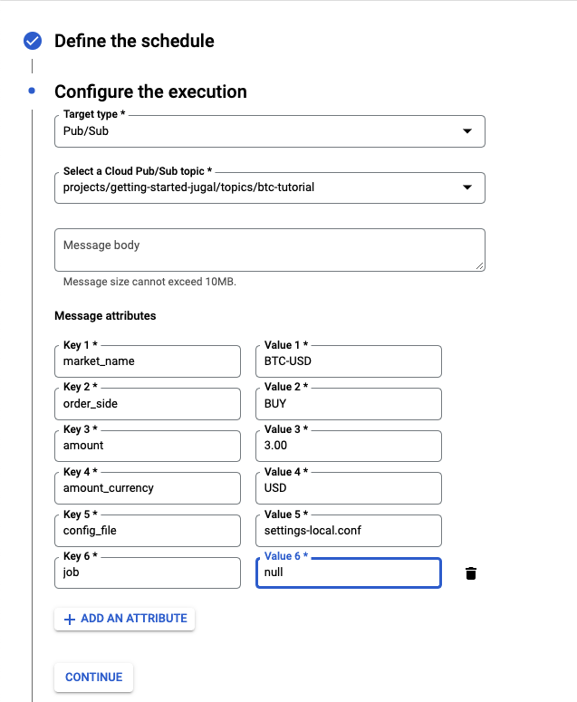

# Deploy automated recurring buys on Google Cloud Platform

## Disclaimer
_Since our use case is lightweight, the gcp's resource requirements fall fairly within gcp's *free quota limit*._

_Inshort these resources should be free of charge for our usecase. <Br>_
_Having said that, I suggest people should do their our research regarding the gcp charge._


## System Architecture


## Initial account set up
* Create up a [google cloud platform account](https://cloud.google.com/gcp?utm_source=google&utm_medium=cpc&utm_campaign=na-US-all-en-dr-bkws-all-all-trial-e-dr-1011347&utm_content=text-ad-none-any-DEV_c-CRE_491349594127-ADGP_Desk%20%7C%20BKWS%20-%20EXA%20%7C%20Txt%20~%20Google%20Cloud%20Platform%20Core-KWID_43700064423315751-kwd-26415313501&utm_term=KW_google%20cloud%20platform-ST_google%20cloud%20platform&gclid=EAIaIQobChMIg_rckMzm9wIVAMqUCR0y6QNHEAAYASAAEgKRG_D_BwE&gclsrc=aw.ds) & add [billing information](https://console.cloud.google.com/billing?authuser=1&supportedpurview=project) to access set of services.
* We will be using three main services from GCP (Make sure you enable them for your GCP account)
  * [Cloud Functions](https://cloud.google.com/functions)
  * [Cloud pubsub](https://cloud.google.com/pubsub)
  * [Cloud Scheduler](https://cloud.google.com/scheduler)


## Tutorial
### Schedule a recurring BTC-USD buy for $3 USD every hour

A Cloud scheduler instance will trigger the pub/sub topic that will inturn trigger the cloud function which will buy BTC for us.

1. Copy the example config file to `settings-local.conf` (`settings-local.conf` is already added to `.gitignore`) and update the file with correct values

	```bash
	cp settings.conf.example settings-local.conf
	```
2. Install python dependencies
   ```bash
   pip install -r requirements.txt
3. Make sure that the dependencies are installed and config values are noted correctly.<Br>
Run a `$1` buy to make sure.
   ```bash
   python gcp_gdax_bot_deploy.py  -market_name BTC-USD -order_side BUY -amount 1.00 -amount_currency USD --config "./settings-local.conf" -j
   ```
4. Now we are ready to deploy the code to GCP (we shall using GCP's webUI to instantiate resources. Its a lot easier to write code to instantiate them, but its less intuitive and requires initial setup). <Br>Go to [GCP's console](https://console.cloud.google.com/)

    #### create pub/sub topic
   1. Create a [pub/sub](https://console.cloud.google.com/cloudpubsub) instance to trigger the cloud instance
   2. lets name the topic - `btc-tutorial` (will use the default settings here).
   3. Once the topic is created, click on the that topic and on the top center screen there will be an option `Trigger Cloud Function`

   #### create a cloud function
   1. Once you click on `Trigger Cloud Function` from the topic page, a left menu bar will pop up create a functon.
   2. lets name the cloud function - `btc-tutorial-func`. Will leave the Region as is to make sure that the pub/sub and cloud func are in the same region. In my case it is `us-central1`
   3. Select `python 3.9` as Runtime and write `main` in the entry_point field.
   4. To make things easier, we will select `Inline Editor` in source code and copy the code from
       1. local file `gcp_gdax_bot_deploy.py` to `MAIN.PY`
       2. local file `requirements.txt` to `REQUIREMENTS.txt`
   5. Click on deploy.
   6. Ideally we want also add our `settings-local.conf` file. But since the UI from topic page doesn't have an opiton to add more files to the source code, we will upload the config file from cloud function webpage.
   	   1. Go to list al all [Cloud Functions ](https://console.cloud.google.com/functions/list) in your project and click on `btc-tutorial-func`
   	   2. Click on edit and select `code` on the top left.
   	   3. You will see a `+` sign on the top left to add additional files to the source code
   	   4. create a new file named `settings-local.conf` and copy the contents from the local `settings-local.conf` file.
   	   5. Click on deploy.

     #### create a cloud scheduler (to schedule the job every hour)
    1. Create a [cloud scheduler](https://console.cloud.google.com/cloudscheduler) instance to trigger the pub/sub topic that will in turn trigger the cloud function
    2. Click on create job on the top of the screen.
    3. Lets name the scheduler as `btc-tutorial-scheduler`. I will keep the region same as the pub/sub topic and the cloud function. I.e `us-central`
    4. For frequency, lets use `16 */1 * * *` i.e triggering the job every 16th minute of the hour. You can change it to what ever you prefer and test your cadence at [crontab.guru](https://crontab.guru/)
    5. Select the time zone. For this tutorial, we will do `EDT(NYC)` and click continue
    6. `configure the execution` - here we want to select the target type of what we want this scheduler to tigger. In our case, we want to tigger the pub/sub with topic `btc-tutorial` that we created earlier.  If you don't see your desired topic in the drop down options, you can copy the entire path of the topic from the topic page and enter it manually.
    7. Since our cloud function takes parameters, we want to pass them as attributes from the cloud scheduler.
    8. Click on `+ ADD AN ATTRIBUTE` and add below parms.
        ```
        market_name = BTC-USD
        order_side = BUY
        amount = 3.00
        amount_currency = USD
        config_file = ./settings-local.conf
        job = null
        ```

        2. 	
   9. Click on create
   10. On the list of scheduler jobs, you will see an option `RUN NOW` next to the scheduler we created `btc-tutorial-scheduler` that will trigger the function with the correct attributes
